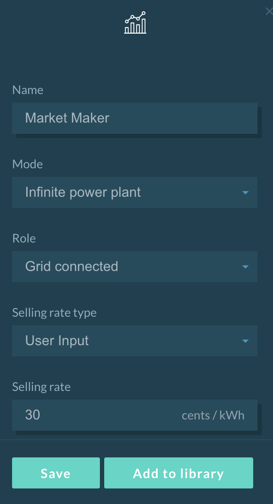

The following parameters can be set in the Market Maker.

- **Name:** The name of the Market Maker.

- **Mode** The user has two options:
    - Infinite power plant: In this mode, it has the ability to meet the infinite energy demands of consumers at the most expansive rate that could exist in that grid.
    - Infinite bus: In this mode, the Market Maker has not only the ability to meet the infinite energy demands of consumer but can also absorb the infinite generation excess of prosumers/producers at the lowest rate the could exist in that grid.

- **Role:** The user has two options:
    - Grid connected: In this role, the Market Maker is connected to the grid and thus can fulfill the energy demands of any consumer and absorb the excess of generation (if infinite bus mode selected)
    - Islanded: In this role, it won’t fulfill the energy demands of any consumer but would only be used as a reference point of highest possible `energy_rate` that could exist in that grid.

- **Selling rate type:** The user can choose either *User Input* to define a fixed rate defined by the *Selling rate* or to upload their own selling rate profile.

- **Selling rate:** The fixed rate the Market Maker will enforce, if *User Input* is chosen for the *selling rate type*.

- **Buying rate type (infinite bus only):** The user can choose either *User Input* to define a fixed rate defined by the *buying rate* or to upload their own buying rate profile.

- **Buying rate (infinite bus only):** The fixed rate the Market Maker will enforce, if *User Input* is chosen for the *buying rate type*.

For further general information about this strategy, follow the backend [Market Maker Strategy](market-maker-strategy.md) and [Infinite Bus Strategy](infinite-bus-strategy.md) manual.

The configuration interface is shown below: 

{:style="height:500px;width:275px"}